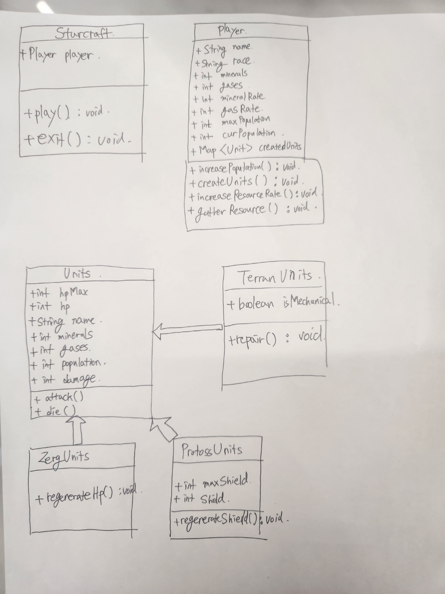

# <h1> 9x년대생의 민속놀이 스타크래프트 게임 </h1>

<h2>개요</h2>
어렸을 적 즐겨했던 스타크래프트 게임의 추억을 회상하며 원작을 최대한 고증해보려고 하였습니다.

<h2>클래스 다이어그램</h2>

위에 그림에는 포함되어 있지 않지만
 
TerranUnit을 상속받는 Marine, Vulture, Tank
 
ZergUnit을 상속받는 Zergling, Hydralisk, Mutalisk
 
ProtossUnit을 상속받는 Zealot, Dragoon, Reaver
 
등이 있습니다.

Terran은 30% 미만의 체력을 가질 시에 불타서 체력이 깎이는 기능과 수리기능
 
Zerg는 체력이 자동으로 차는 기능
 
Protoss는 체력 외에 실드가 존재하며 실드가 자동으로 차는 기능이 있습니다.
 

주요 기능
1. 닉네임 & 종족 선택 
 
 
2. 자원 현황보기 
 
3. 미네랄 일꾼 뽑기 
 
4. 가스 일꾼 뽑기 
 
5. 최대 인구수 뚫기 
 
6. 유닛 뽑기 
 
 
7. 유닛 목록 보기 
 

  

자원 채집과 특수능력은 5초마다 자동 발동됩니다.

<미구현 기능>
1. 각 유닛의 특수기능(마린 스팀팩, 저글링 버로우 등등)
2. 각 유닛의 특성(공중여부, 공격형태(진동형,폭발형,일반형), 대공능력, 유닛 크기(소,중,대형))
3. 공격 기능
4. 승리 조건을 반영
 
 
 
<회고>
 
1. 매번 반복되는 코드(marine, vulture 등 생성하기)를 짜는데 복붙을 했다. 하지만 추후에 코드를 수정하기에 복붙한 모든 부분들을 다 고쳐야하는 번거로움이 있었다. 이에 대해 찾아보니, Factory Pattern을 적용시키면 더 간결하고 유지보수에 좋게 코드를 짤 수 있다는 걸 알게 되었다.(적용은 하지 않았지만 추후에 적용을 해봐야겠다.) 
2. Github를 설정하는데 애를 많이 먹었다.(특히 인증하는 부분.) 그동안 Github 및 Git 사용법에 대해 제대로 알고 있지 않았구나 하는것을 깨닫고, 더 부딪히며 알아가야겠다. 
3. 미리미리 과제를 해야겠다고 마음만 먹고 미리미리 하지 않은것이 아쉽다. 32년 인생에서 항상 일을 미뤄버릇했고, 그 결과가 지금 나이에도 미취업자인 것임을 가슴 깊이 각인해야한다. 
4. 마크 다운 문법 아직 어렵다..

